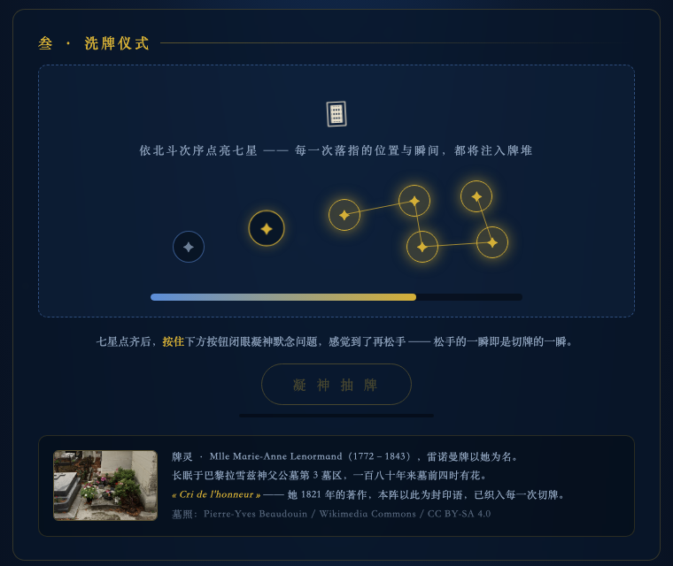
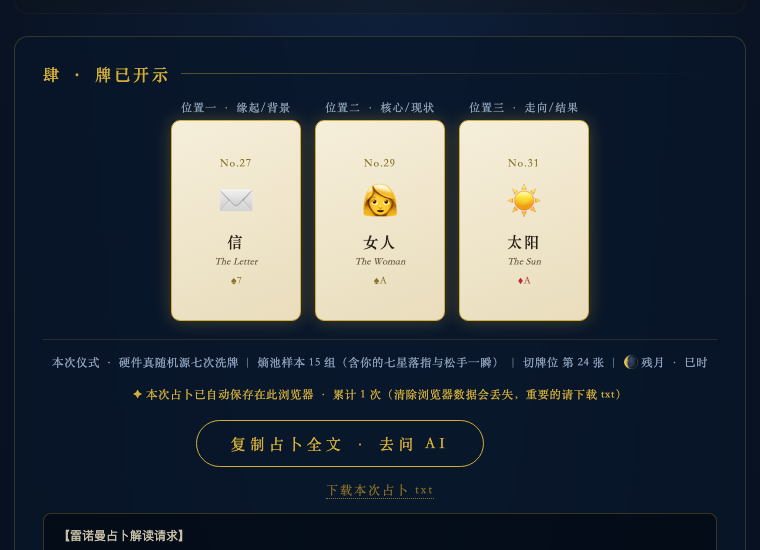

# 雷诺曼秘仪 · Lenormand Oracle

一个开箱即用的雷诺曼（Lenormand）占卜工具：真随机洗牌抽牌，一键复制完整占卜文，粘贴给任何 AI（Claude / ChatGPT / DeepSeek…）获得正统技法的解读。

**在线使用：https://lynnnnnnnnnew.github.io/lenormandforyou/**

无需安装、无需注册，手机电脑都能用。

  
  

## 使用方法

1. 写下你的问题，心中默念三遍
2. 选择牌阵：单张指引 / 三张 / 五张 / 九宫格（大事用九宫格）
3. 洗牌仪式：在牌堆区画圈移动鼠标（手机上用手指），为洗牌注入你自己的随机之力
4. 按住「凝神抽牌」默念问题，感觉到了再松手——松手的一瞬即是切牌的一瞬
5. 开牌后点「复制占卜全文」，粘贴给你常用的 AI 即可获得解读

## 它的后台是认真的

- **真随机**：`crypto.getRandomValues` 硬件级随机源七次洗牌，并做了均匀性修正
- **人牌感应**：切牌位置由你的鼠标轨迹熵 + 问题文字 + 松手瞬间的微秒共同哈希决定——同一问题、不同的人、不同心境，牌不一样
- **天时入卦**：实时月相（月龄、光照比）与十二时辰一并写入占卜文
- **正统解读技法内置于 prompt**：雷诺曼组合造句读法（非塔罗式逐张堆砌）、是非题牌性多数决铁律、九宫格镜像位与对角线技法、36 张牌的传统牌意与扑克映射
- **封印语**：每一次切牌的运算中都织入了雷诺曼女士 1821 年著作《Cri de l'honneur》与她的名字

## 设计决策记录

- **是非题铁律的由来**：一次真实占卜（射覆式验证，问冰箱里有没有某样东西）抽出两吉一中，AI 却用联想叙事读出了「否」，与事实不符。归因不在随机层，在解读层——prompt 只教了组合叙事，没教雷诺曼处理是非题的正统技法。修正：给 36 张牌全部标注牌性（吉／凶／中），并在解读要求中规定「先牌性多数决出是／否，联想叙事不得推翻多数决」。
- **随机与「人的参与」分层**：`crypto.getRandomValues` 负责均匀性（含拒绝采样修正），是不可妥协的底线；占卜者的落指坐标、微秒时刻、问题文字与封印语只参与切牌哈希——让「同人同问不同心境则牌不同」从修辞变成可复现的确定性计算，而不损害随机的公平。
- **手机端的仪式重设计**：初版以「画圈移动鼠标」收集熵，手机上难以操作；改为依北斗次序点按七星，乱序落指计熵但不计进度。星间连线平时隐形（避免被误解为滑动手势），点亮后才渐次浮现金线。
- **克制的解读边界**：每份占卜文的解读要求以固定一句收尾——占卜仅供参考与自省，未来始终掌握在自己手中，请勿沉迷。

## 隐私

本页面是纯静态页面，仅通过 [GoatCounter](https://www.goatcounter.com/) 统计匿名访问量（无 cookie、不追踪个人）。你的问题和牌局不会上传到任何服务器，只保存在你自己的浏览器里，可随时一键导出为 txt。

## 致敬

牌灵 Mlle Marie-Anne Lenormand（1772–1843），雷诺曼牌以她为名，长眠于巴黎拉雪兹神父公墓第 3 墓区，一百八十年来墓前四时有花。

墓照：Pierre-Yves Beaudouin / Wikimedia Commons / [CC BY-SA 4.0](https://creativecommons.org/licenses/by-sa/4.0/)

## 免责声明

占卜结果由随机抽牌与 AI 解读产生，仅供娱乐与自省，不构成任何医疗、法律、投资建议。
